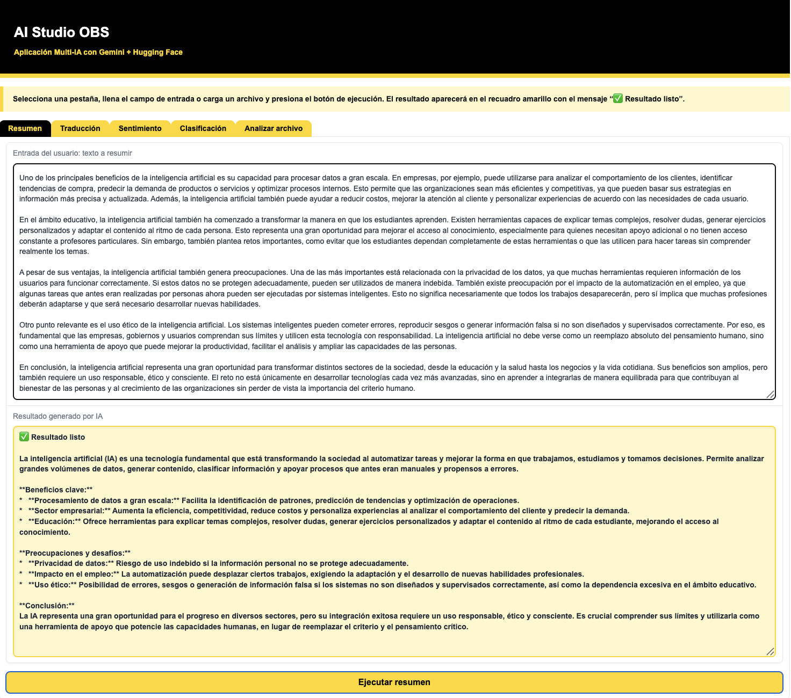
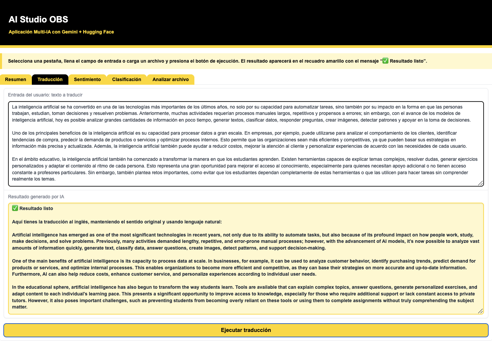
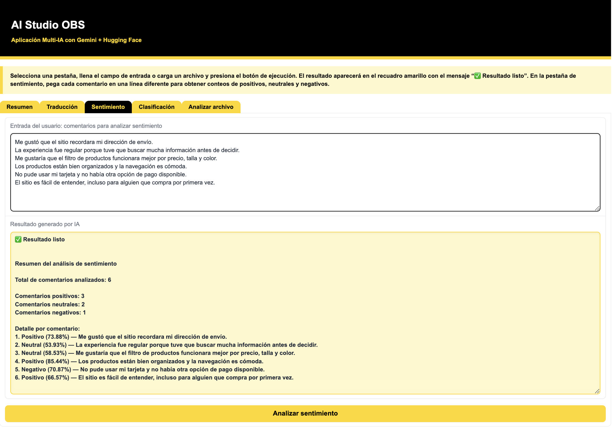
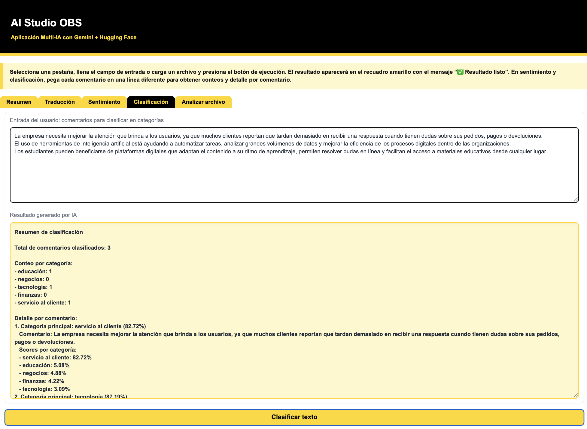
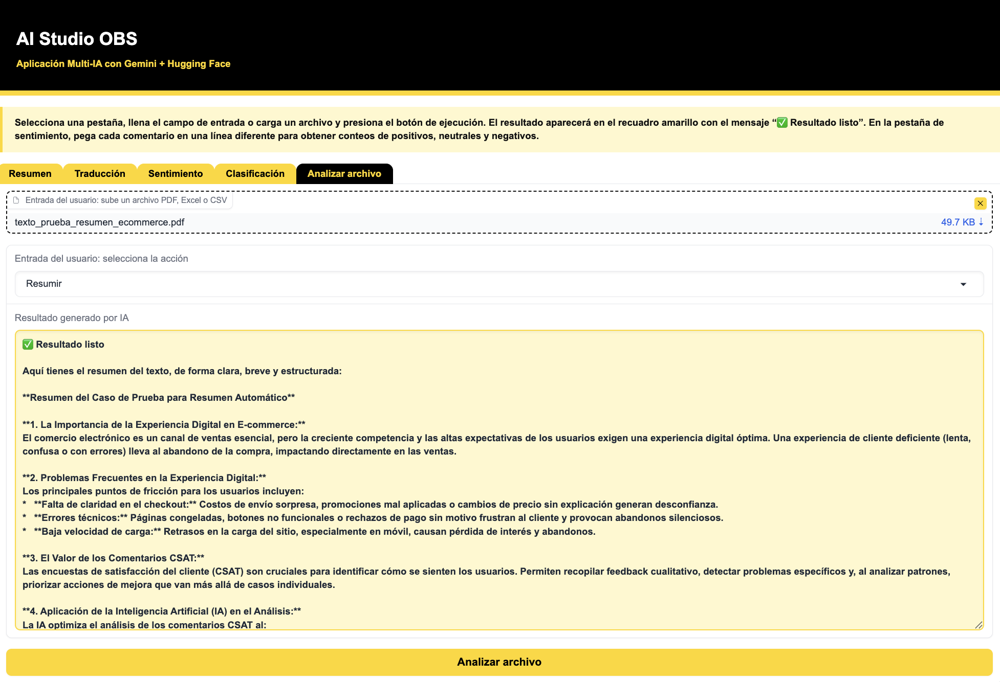
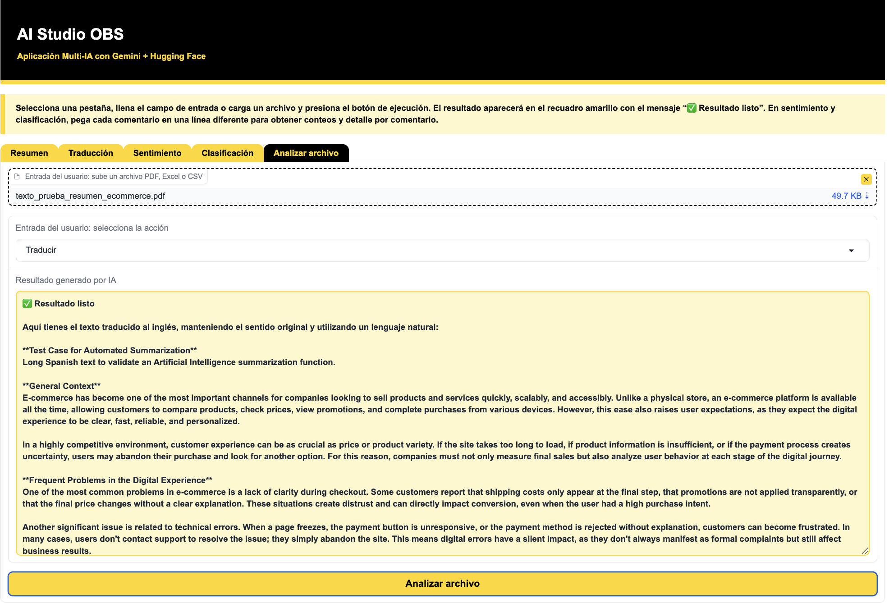
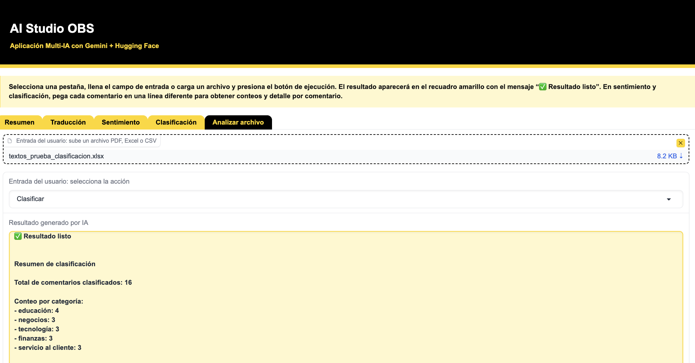
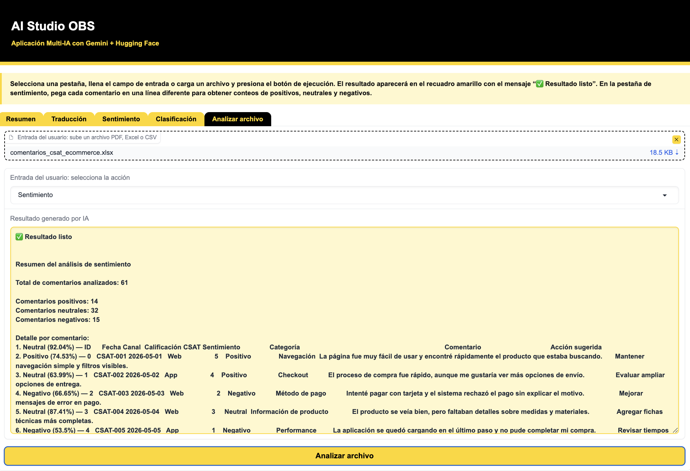

# Título: AI Studio OBS - App Multi-IA con Gradio

## Descripción del proyecto

AI Studio OBS es una aplicación web desarrollada con Gradio que fue construida al 100% con herramientas de Inteligencia Artificial y permite utilizar distintas capacidades de IA desde una interfaz sencilla organizada mediante diferentes pestañas.

La aplicación incluye funcionalidades de resumen de texto, traducción, análisis de sentimiento y clasificación de contenido utilizando modelos de Gemini y Hugging Face.

La aplicación permite al usuario trabajar tanto con texto ingresado manualmente como con archivos en formato PDF, Excel o CSV. A partir de este contenido, es posible ejecutar diferentes operaciones de Inteligencia Artificial, como generación de resúmenes, traducción, análisis de sentimiento y clasificación de textos.

El objetivo del proyecto es demostrar la integración de modelos de IA generativa y distintos modelos de Hugging Face dentro de una aplicación web funcional, utilizando Python, consumo de APIs y procesamiento de lenguaje natural mediante prompts para la generación y análisis de contenido.


## Funcionalidades 

- Resumen de texto con Gemini
- Traducción de texto con Gemini
- Análisis de sentimiento con Hugging Face Transformers
- Clasificación zero-shot con Hugging Face Transformers
- Análisis de archivos PDF, Excel y CSV

## Tecnologías utilizadas

- Python
- Gradio
- Gemini API
- Hugging Face Transformers
- Pandas
- PyPDF2
- Requests
- Python-dotenv

## Instalación y ejecución local

```bash
# Clonar el repositorio
git clone LINK_DEL_REPOSITORIO
cd mi-web-ia-gra

# Crear y activar entorno virtual
python3 -m venv venv
source venv/bin/activate

# Instalar dependencias
pip install -r requirements.txt
pip install gradio requests pandas openpyxl PyPDF2 python-dotenv transformers torch google-generativeai

# Crear archivo .env con la API Key de Gemini
# GEMINI_API_KEY=tu_api_key_aqui

# Ejecutar la aplicación
python app.py
```
## Link de App

https://huggingface.co/spaces/pfloresz/ai-studio-obs

# Capturas de pantalla

## Resumen de texto


## Traducción


## Análisis de sentimiento


## Clasificación de texto


## Resumen de PDF


## Traducción de PDF


## Clasificación desde Excel


## Análisis de sentimiento desde Excel

